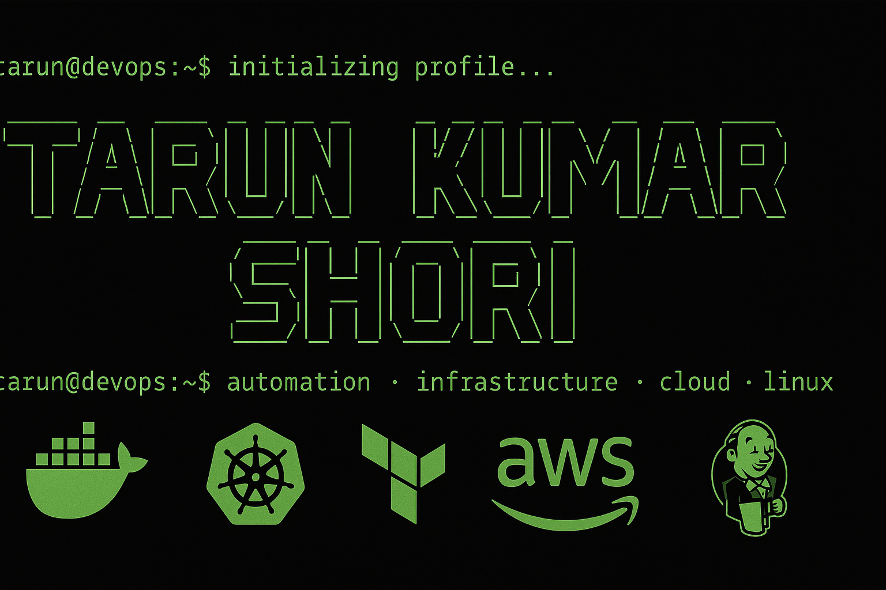

<!-- Terminal-Themed DevOps Banner -->

  

<h3 align="center">Cloud & DevOps Engineer • AWS Certified • Terraform • Kubernetes • CI/CD • Linux</h3>

  

  
  
  
  

---

## 🌟 About Me

Hi there! I'm **Tarun**, an **AWS Certified Cloud Practitioner** and forward-thinking **DevOps Engineer** who builds, automates, and scales cloud-native systems. My mission is simple:  
**Build infrastructure that is reliable, secure, self-healing, and lightning-fast.**

I operate at the sweet spot between **cloud engineering**, **DevSecOps**, and **developer productivity**, leveraging automation and modern tooling to streamline delivery pipelines and improve system resilience.

I design infrastructure that is:
- 💠 **Reliable**
- ⚙️ **Secure**
- 📈 **Scalable**
- 🚀 **Lightning-Fast**

---

# 🧰 Tech Stack & Tooling 

### ☁️ **Cloud Platforms**

  

AWS (EC2, VPC, S3, RDS, Lambda, CloudWatch, IAM, ASG)

---

### 📦 **Containers & Orchestration**

  

Docker | Kubernetes | Helm | EKS

---

### ⚙️ **Infrastructure as Code**

  

  

Terraform | CloudFormation

---

### 🔄 **CI/CD & Release Engineering**

  

  
  
  

Jenkins | ArgoCD | GitOps | Maven | Nexus | Groovy | GitLab CI

---

### 🔐 **DevSecOps**

  
  
  

Trivy | SonarQube | OWASP | Docker Scout | IAM | NACLs

---

### 📊 **Observability**

  
  
  

Prometheus | Grafana | ELK Stack | CloudWatch

---

### 🐧 **Operating Systems**

  

Linux | Ubuntu | CentOS

---

### 🛠️ **Scripting & Programming**

  

Bash | Python | YAML | Dockerfile

---

### 🤖 **AI Development Tools**

  
  
  
  
  

GitHub Copilot | Amazon Q | Gemini CLI | ChatGPT | Kiro

---

## 🏆 AWS Certification
🎓 **AWS Certified Cloud Practitioner**  
📅 Issued: *April 2025*  
🔗 Verification:  
https://www.credly.com/badges/f7916ed9-1d55-41e7-bbc0-222b47d6e4c3/public_url  

---

## 🔥 Key Impact Wins
- Automated **30+ AWS resources** with Terraform → *70% faster provisioning*  
- Reduced deployment time **from 2 hours to 15 minutes**  
- Blocked **12+ critical vulnerabilities** with DevSecOps integrations  
- Implemented full observability → *auto-scaling + proactive alerting*  
- Managed **secure, high-availability** cloud infrastructure  

---

## 🚀 Featured Projects
- AWS Terraform Modules  
- Kubernetes Helm Deployments  
- Jenkins CI/CD Pipelines  
- Prometheus + Grafana Monitoring Stack  

---

## 💬 Let’s Connect

  
  
  

---

<h3 align="center">✨ Automating • Scaling • Securing • Observing ✨</h3>
<h3 align="center">✨ Always Building What's Next ✨</h3>

